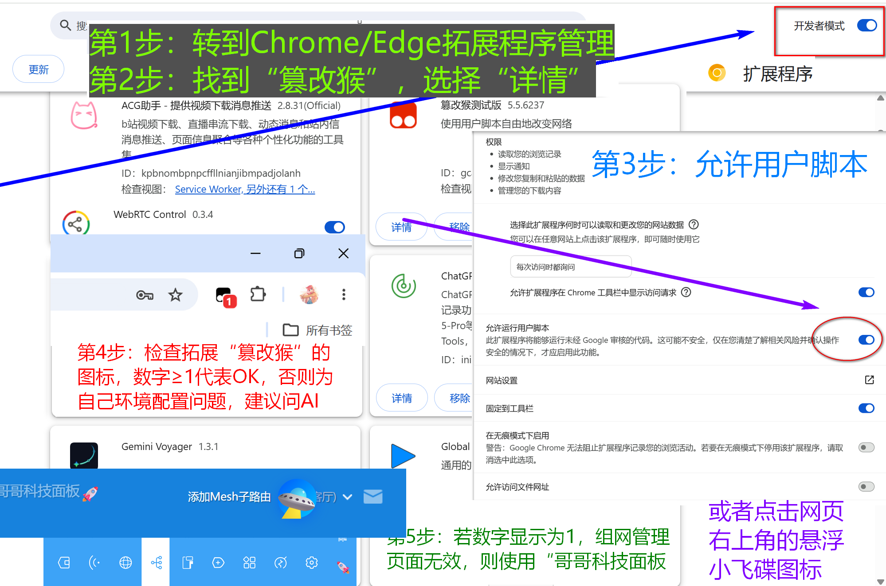
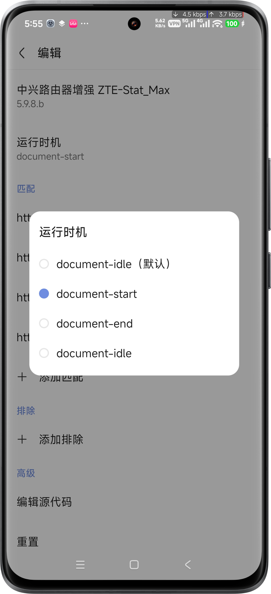
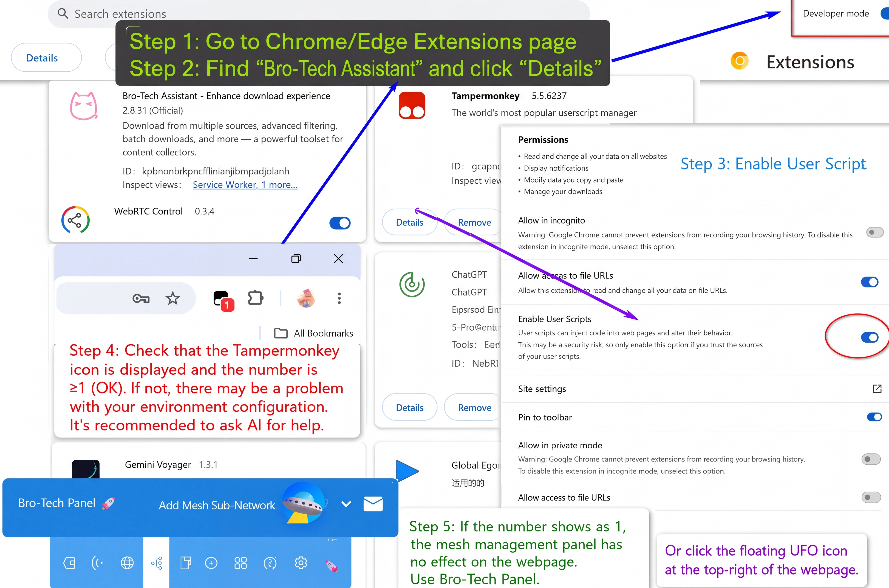

# 🚀 Bro-Stat 开发版安装&nbsp;&nbsp;

[English](#English) | **简体中文**

本页面提供 **Bro-Stat 最新开发版** 的直接安装入口。

> 需要预先安装 **ScriptCat（脚本猫）** 或其他兼容的用户脚本管理器。  
> 开发版直接跟随 `main` 分支的最新源码更新，相比正式发行版可能具有更频繁的功能变化。

## 一键安装

请选择你正在使用的路由器品牌：

| 路由器品牌 | 开发版 |
| --- | --- |
| **TP-Link（普联）** | [安装 TP-Link 版](https://raw.githubusercontent.com/ucxn/Bro-Stat/main/TP-L1.user.js) |
| **华硕 ASUS / ROG / TUF** | [安装华硕版](https://raw.githubusercontent.com/ucxn/Bro-Stat/main/ASUS-1.user.js) |
| **华为 HUAWEI** | [安装华为版](https://raw.githubusercontent.com/ucxn/Bro-Stat/main/Huawei-1.user.js) |
| **H3C / 新华三** | [安装 H3C 版](https://raw.githubusercontent.com/ucxn/Bro-Stat/main/H3C-TX_1801.user.js) |
| **腾达 Tenda** | [安装腾达版](https://raw.githubusercontent.com/ucxn/Bro-Stat/main/Tenda-1.user.js) |
| **小米 / MiWiFi** | [安装小米版](https://raw.githubusercontent.com/ucxn/Bro-Stat/main/Mi-WiFi_RD.user.js) |
| **中兴 ZTE** | [安装 ZTE-Stat_Max](https://raw.githubusercontent.com/ucxn/ZTE-Stat_Max/main/new.user.js) |

点击对应链接后，脚本管理器通常会自动弹出安装页面。
#### 故障排查
如果浏览器直接显示了 JavaScript 源码，请检查是否已经安装并启用了兼容的用户脚本管理器。**[脚本如何安装？三方教程](https://docs.scriptcat.org/docs/use/use)**

> [!NOTE]
> 移动端  **Via** 浏览器 脚本/插件 *功能无法生效*？
> 

> 
👉 点此展开查看解决办法

>  由于 Via 浏览器的内核机制限制，默认的 `document-idle` 无法成功注入。
>  请进入 Via 的脚本管理界面，将运行时期修改为 `document-start`或`document-end` 均可。 
>  
> 

> [!IMPORTANT]
> 请确保 **脚本管理器** 运行正常！！也就是 浏览器 拓展图标这里，正常显示数字！允许用户脚本注入教程如下图。 

> [!TIP]
> 若脚本仍未生效，请使用如下教程：

## 品牌专版

小米与中兴同时拥有独立维护的专版仓库，其中包含更完整的品牌专属说明、开发历史及相关功能：

- **小米：** [Mi-Stat_Max](https://github.com/ucxn/Mi-Stat_Max)
- **中兴：** [ZTE-Stat_Max](https://github.com/ucxn/ZTE-Stat_Max)
- **Home Assistant 联动：** [ZTE-Stat_HA](https://github.com/ucxn/ZTE-Stat_HA)

如需正式发行版，请前往 [Bro-Stat Releases](https://github.com/ucxn/Bro-Stat/releases)。

# English&emsp;&nbsp;
This page provides direct installation links for the **latest development builds** of Bro-Stat.

> Tampermonkey, **ScriptCat**, or another compatible userscript manager is required.  
> Development builds follow the latest source code on the `main` branch and may change more frequently than stable releases.

## One-Click Installation

Choose the router brand you are using:

| Router Brand | Development Build |
| --- | --- |
| **TP-Link** | [Install TP-Link](https://raw.githubusercontent.com/ucxn/Bro-Stat/main/TP-L1.user.js) |
| **ASUS / ROG / TUF** | [Install ASUS](https://raw.githubusercontent.com/ucxn/Bro-Stat/main/ASUS-1.user.js) |
| **HUAWEI** | [Install HUAWEI](https://raw.githubusercontent.com/ucxn/Bro-Stat/main/Huawei-1.user.js) |
| **H3C / ISP Customized** | [Install H3C](https://raw.githubusercontent.com/ucxn/Bro-Stat/main/H3C-TX_1801.user.js) |
| **Tenda** | [Install Tenda](https://raw.githubusercontent.com/ucxn/Bro-Stat/main/Tenda-1.user.js) |
| **Xiaomi / MiWiFi** | [Install Xiaomi](https://raw.githubusercontent.com/ucxn/Bro-Stat/main/Mi-WiFi_RD.user.js) |
| **ZTE** | [Install ZTE-Stat_Max](https://raw.githubusercontent.com/ucxn/ZTE-Stat_Max/main/new.user.js) |

After clicking the corresponding link, your userscript manager should automatically open the installation page.
### Trouble?
If the source code is displayed directly instead, make sure a compatible userscript manager is installed and enabled in your browser. 
**[Third-Party Guide](https://docs.scriptcat.org/en/docs/use/use/)**

> [!IMPORTANT]
> **Alternative entry point**: Make sure the **userscript** extension is running correctly. The extension icon in your browser should show a number. See the image below for how to enable userscript injection.

> [!NOTE]
> **Via Browser (mobile)**: Script/plugin features *not working*?
> 

> 
👉 Click to view the fix

>  Due to limitations in Via Browser's rendering engine, the default `document-idle` injection timing may fail to trigger correctly. 
>  Open Via's script management page and change the execution timing to either `document-start` or `document-end`. 
>
> 
> 

 
> [!TIP]
> If the script still isn't taking effect, refer to the graphic tutorial below:
> 

## Specialized Editions

Xiaomi and ZTE also have dedicated repositories with additional documentation, development history, and brand-specific features:

- **Xiaomi:** [Mi-Stat_Max](https://github.com/ucxn/Mi-Stat_Max)
- **ZTE:** [ZTE-Stat_Max](https://github.com/ucxn/ZTE-Stat_Max)
- **Home Assistant Integration:** [ZTE-Stat_HA](https://github.com/ucxn/ZTE-Stat_HA)

For stable versions, see the [Bro-Stat Releases](https://github.com/ucxn/Bro-Stat/releases).
---
**Bro-Stat** · Copyright © 2026 哥哥科技
