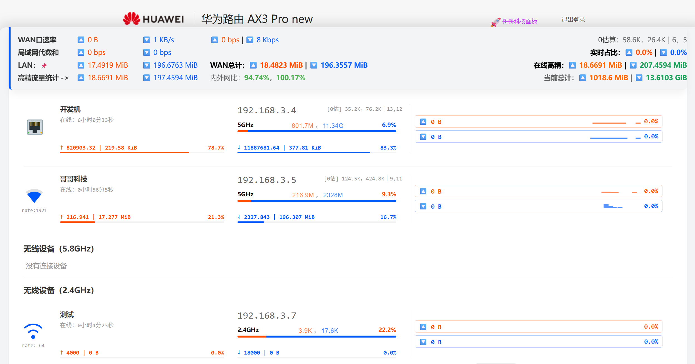

# 🚀 Bro-Stat：全平台路由器增强监控组件

[English](README_en.md) | **简体中文**

**Bro-Stat** 是一个致力于改善各大品牌硬路由原生 Web 后台体验的浏览器扩展组件。目前通用版主要适配并优化 **TP-Link（普联）、小米（MiWiFi）、华硕 (ASUS/ROG)、华为**（或许还有HONOR） 等常见品牌的路由器后台，是一款 哥哥科技 开发的一套网络数据遥测与多端转发解决方案。

全屋智能家居平台联动接入插件：Home Assistant 极客集成、UI增强，硬路由+NPU 最佳伴侣、无需刷机，支持全系ZTE！设备列表平铺化，大屏可视化一点通，你所要的，都在这里，无需频繁切换页面…

原生路由器后台通常只能提供最基础的瞬时网速，且数据往往在设备掉线或路由器重启后直接清零。我们希望通过这套轻量级的组件，为你提供更持久、更直观的家庭网络流量可视化面板→支持定期导出.csv数据。

**Bro-Stat 增强组件** Copyright © 2026 哥哥科技 (BroTech) | [点击分享](https://scriptcat.org/users/203510)

B站：[哥哥科技：501430041](https://space.bilibili.com/501430041)

---

**品牌硬路由专版**
* 小米路由器：[Mi-Stat_Max](https://github.com/ucxn/Mi-Stat_Max)
* 中兴路由器：[ZTE-Stat_Max](https://github.com/ucxn/ZTE-Stat_Max)
* **HA上报联动**：[全品牌通用](https://github.com/ucxn/ZTE-Stat_HA)

### 💡 核心特性

#### 1. 数据存储
原生路由器的流量统计往往是没有记忆的。本组件引入了本地快照持久化机制：每次你打开网页，它会自动读取上一次的流量快照，并与当前的底层数据进行无缝接力。
哪怕路由器断电重启、设备重新连接，你依然能在面板上看到设备自挂机以来的真实历史上下行消耗，让偷偷跑流量的设备无处遁形。

#### 2. 微型时序火花线 (Sparklines)
我们不使用第三方图表库，用纯粹的字符画在网速条中央构建了动态波形图：
* **峰值悬停**：采用类似 Windows 任务管理器的 Y 轴黏滞算法，大流量波峰过后，坐标轴会平滑回落，减轻视觉抖动。
* **底噪过滤**：杂波过滤，日常微弱流量会自动隐身，只有真正有意义的吞吐量才会激起波浪，一眼看清网络波动的真实形状。

#### 3. 心跳探测
当设备的网速极低（例如智能家居的 MQTT 心跳包）时，原生后台通常会粗暴地显示为 `0` 或 `1 KB/s` 的生硬跳动。我们引入了十六分之几（如 `[3/16] KiB/s`）的微小分数映射机制。
即便设备处于待机状态，你也能通过这丝微弱的“脉搏”，准确判断设备状态。

#### 4. 高精度的上行追踪 (PCDN 探照灯)
针对国内宽带上行资源宝贵的现状，组件在数据呈现上做了明确的切分：
* **下行方向**：注重“赛跑感”，直观展示当前谁在占用你的下载带宽。
* **上行方向**：采用“记账模式”，独立的橙色进度条和雷达比例，清晰记录每台设备的累计上传占比。结合波形形状（平稳持续/脉冲突发），轻松排查局域网内的疑似 PCDN 节点。

#### 5. 性能优化
作为一个需要长期挂在后台的监控面板，流畅度至关重要。
组件底层采用纯数学的梯形积分算法剥离了冗余的 API 轮询，渲染层则利用原生 DOM 穿透与 Flex 布局锁死重排（Reflow）。哪怕局域网内有上百台智能设备同时刷新，浏览器的内存与 CPU 占用曲线依然能保持一条平稳的直线。

#### 6.🏠 **联动 Home Assistant**：
搭配专属的 哥哥科技 中枢集成，支持通过 Webhook 将状态实时推送到 HACS 插件。避免Web只能单端接入，实现多端并发观测。详见兄弟项目：[ZTE-Stat_HA](https://github.com/ucxn/ZTE-Stat_HA)

#### 7. 定制化精准 Wi-Fi 信号图标 SVG

---

### ⚙️ 支持的布局与模式

我们为不同尺寸的屏幕和审美偏好提供了灵活的配置项（可在脚本开头修改 `CONFIG`）：

* **全宽悬浮舱**：打破原生后台的定宽限制，左右铺满，提供最宽广的数据展示视野（TP 等品牌默认推荐）。
* **驾驶舱美学 (UI Layout 1)**：数据紧凑，重点突出，适合需要同屏监控海量设备的场景。
* **报表流美学 (UI Layout 2)**：平铺展示，间距舒适，适合作为常亮副屏的监控看板。

---

### 📦 安装与使用说明

1. 确保你的浏览器已安装 **Tampermonkey** 或 **ScriptCat（脚本猫）** 扩展。
2. 点击本页面的“安装脚本”。
3. 登录你的路由器 Web 后台（如 `tplogin.cn` 或 `192.168.31.1`）。
4. 页面右侧会自动出现 🛸 悬浮按钮，点击即可展开监控面板。（你也可以点击面板上的 📌 图标，将监控数据冻结在页面顶端）。

> *“在一个文明社会，干净的、不被监视与吸血的网络，是我们每个人的基本权利。”*

本交互式程序基于 **GNU Affero GPL v3.0** 协议开源，按“原样 (AS IS)”提供，不对其适用性、稳定性、精密度或任何商业场景合规性作任何明示或暗示的担保。