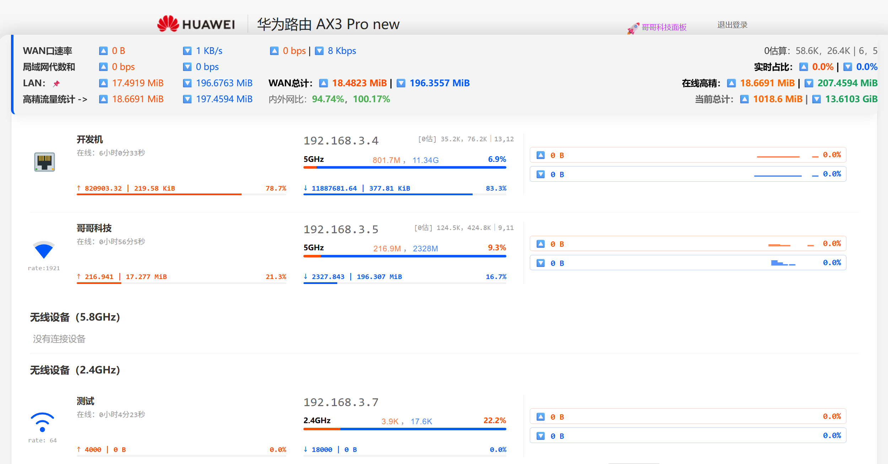
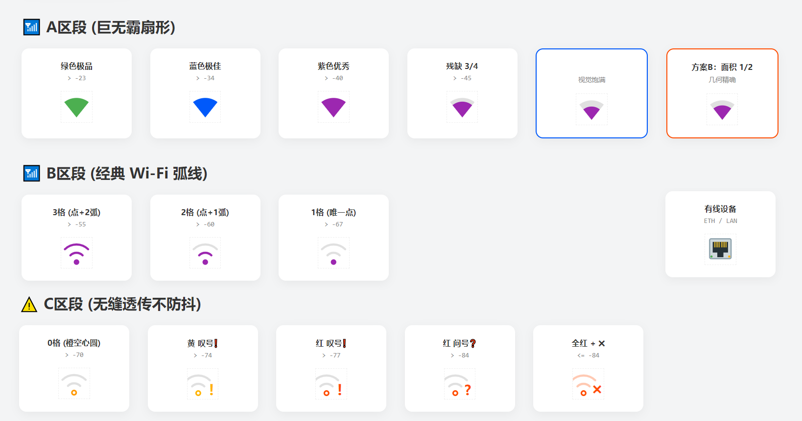

# 🚀 Bro-Stat: Universal Router Monitoring Enhancement Suite

**English** | [简体中文](README.md)

**Bro-Stat** is a browser-based extension designed to improve the native web management experience of consumer and prosumer routers across multiple brands.

## One-Click Install&emsp;

**[Userscript Manager](https://github.com/ucxn/ZTE-Stat_Max/blob/main/README_EN.md#requirements)**&emsp;**[Home Assistant Smart Home Integration](https://github.com/ucxn/ZTE-Stat_HA/blob/main/custom_components/gbnpa_router/Readme.md)**

[**Development Build (Latest)**](./.github/Install.md)&nbsp;
[**Release Build (Stable)**](https://github.com/ucxn/Bro-Stat/releases)

The current universal edition primarily supports and enhances routers from **TP-Link, Xiaomi (MiWiFi), ASUS/ROG，HUAWEI, H3C(ISP), Tenda, ZTE**, and other mainstream vendors.

Built using professional measurement and control principles and crafted with the meticulous attention to detail characteristic of BroTech.It supports a wide range of commercially available home router brands, and its architecture is theoretically compatible with nearly all specifications: all consumer-grade gateways that provide data via a web interface.

For a description of the project and its design philosophy, see [my personal homepage](https://github.com/ucxn/BroTech/blob/Brother/README_EN.md). I strongly recommend reading the architecture design; of course, I’d be even happier if you audited the source code directly—you’ll usually find far more surprises there than you’d expect from just reading the introduction. This isn’t just a simple UI enhancement plugin; it’s a complete set of processing algorithms tailored for chaotic and discrete data sources, embodying the true spirit of a geek. 

Developed by **BroTech**, Bro-Stat provides a lightweight network telemetry and multi-end data forwarding solution for modern home and enthusiast networks. Output to CSV File Regularly is supported.

Integrated with smart home ecosystems and Home Assistant, it delivers advanced UI enhancements, telemetry synchronization, and router monitoring capabilities without requiring custom firmware. It serves as an ideal companion for hardware-accelerated routing platforms and supports the entire ZTE router ecosystem. Device lists become cleaner, dashboards become larger, and network insights become instantly accessible without endless page switching.

Native router dashboards usually provide only basic instantaneous bandwidth information. In many cases, all traffic statistics disappear after a reboot or device reconnection. Bro-Stat aims to provide a persistent, intuitive, and lightweight LAN traffic visualization layer while preserving the original router interface.

**Bro-Stat Enhancement Suite**
Copyright © 2026 BroTech (哥哥科技) | All Rights Reserved

Bilibili：[哥哥科技：501430041](https://space.bilibili.com/501430041)

## 🔗 Specialized Editions for WhiteBox Routers Brand

**Mi-Stat_Max (Xiaomi Routers)**
https://github.com/ucxn/Mi-Stat_Max

**ZTE-Stat_Max (ZTE Routers)**
https://github.com/ucxn/ZTE-Stat_Max

**Home Assistant Integration (HACS)**
[Universal Edition](https://github.com/ucxn/ZTE-Stat_HA)

## 💡 Core Features
### 1. Persistent Traffic Storage
Most router traffic counters have no memory.

Bro-Stat introduces a local snapshot persistence mechanism. Every time the dashboard is opened, the extension automatically loads the previous traffic snapshot and seamlessly continues tracking from the latest router statistics.

Even after router reboots or device reconnections, historical upload and download consumption remains visible, making it much easier to identify devices silently consuming bandwidth.
### 2. Miniature Time-Series Sparklines
Instead of relying on third-party chart libraries, Bro-Stat renders dynamic traffic waveforms directly using lightweight character-based sparklines.
#### Peak Retention
Inspired by Windows Task Manager, the Y-axis uses a sticky scaling algorithm. After a large traffic spike, the scale gradually falls back rather than instantly collapsing, significantly reducing visual jitter.
#### Noise Suppression
Background traffic is automatically filtered out. Tiny fluctuations disappear into silence, while meaningful throughput creates visible waveforms, allowing network activity patterns to be recognized at a glance.
### 3. Heartbeat Detection
When traffic drops to extremely low levels, such as MQTT heartbeat packets from smart home devices, native router interfaces typically display crude values like `0 KB/s` or `1 KB/s`.

Bro-Stat introduces a fractional display mechanism based on sixteenth increments, such as `[3/16] KiB/s`.

Even when a device is effectively idle, these subtle "digital heartbeats" allow users to determine whether the device remains online and active.
### 4. High-Precision Upload Tracking (PCDN Spotlight)
Because upstream bandwidth is often the most valuable resource on residential broadband connections, Bro-Stat treats upload and download traffic differently.
#### Download Direction
Focused on real-time competition. Instantly shows which devices are consuming downstream bandwidth.
#### Upload Direction
Uses an accounting-oriented visualization model. Independent orange progress bars and proportional radar indicators clearly display cumulative upload contributions for every device.

Combined with waveform patterns (continuous transmission versus burst traffic), suspicious PCDN activity within the LAN can be identified quickly and intuitively.
### 5. High-Precision Traffic Counter & Redesigned Grid UI ⏱️🖥️
Along with high-frequency frontend sampling, supported router models also pull cumulative throughput data directly from the router’s internal interface. This allows you to track the actual bandwidth consumed by each device during your current browsing session. Both metrics are displayed side-by-side for easy cross-referencing and normalized to current session values, making usage changes clear at a glance.

*Note:* The "high-precision" counter pulls from the router’s native per-MAC cumulative metrics, but we’ve calibrated it to correct common vendor bugs like counter resets, overflows, and rollbacks. Unlike the vague summaries in official companion apps, this gives you a clean breakdown of both upload and download traffic. The frontend counter simply serves as a reliable secondary reference so you don't lose visibility if the router's interface hiccups—its sampling rate does not affect the accuracy of the underlying hardware counter.
### 6. Event-Driven Sampling 🌈
We refined the data integration logic to prevent phase mismatches and sampling misalignments from throwing off total traffic calculations (the area under the curve). Instead of relying on rigid polling timers, sampling intervals are anchored to actual throughput changes: the moment upload or download speeds shift, a new sample is recorded, preventing stale or cached values from being read.

This approach resolves the common issue of mismatched refresh intervals across different router endpoints. More importantly, it eliminates the pitfall where polling faster than the router's internal update cycle actually makes the numbers *less* accurate. In addition, an internal "Group Time" window significantly reduces the chance of consecutive speed frames colliding with each other.
### 7. 🏠 Home Assistant Integration
When paired with the dedicated **BroTech Hub Integration**, device and traffic states can be pushed to Home Assistant through Webhooks and HACS-compatible integrations.

This eliminates the single-client limitation of traditional web dashboards and enables simultaneous monitoring from multiple devices and platforms.

Companion project:
[**ZTE-Stat_HA**](https://github.com/ucxn/ZTE-Stat_HA)
### 8. Customized, Precise Wi-Fi Signal SVG Icons
## ⚙️ Supported Layouts & Modes

Bro-Stat provides flexible configuration options for different screen sizes and visual preferences. Settings can be adjusted directly through the `CONFIG` section.

### Full-Width Floating Console

Removes the fixed-width limitations of many native router dashboards and expands monitoring panels across the entire screen.

Recommended for TP-Link and similar router platforms.

### Cockpit Layout (UI Layout 1)

Compact, information-dense, and optimized for monitoring a large number of devices simultaneously.

### Dashboard Report Layout (UI Layout 2)

A cleaner and more spacious presentation style, ideal for always-on secondary displays and dedicated monitoring screens.

## 📦 Installation

1. Install **Tampermonkey** or **ScriptCat** in your browser.
2. Click **Install Script** on this page.
3. Log in to your router's web management interface (for example, `tplogin.cn` or `192.168.31.1`).
4. A 🛸 floating button will automatically appear on the right side of the page. Click it to open the monitoring dashboard.

You may also pin the panel to the top of the page using the 📌 icon for permanent visibility.

## 📜 Legal Notice & Open Source Statement

> *"In a civilized society, a clean network—free from surveillance and leeching—is a fundamental right for everyone."*

Out of respect for Developer-friendly contributors, any modification, redistribution, or derivative work based on this project must preserve the attribution and legal notice section displayed at the bottom of the interface.

Maintaining the visibility of these notices is a prerequisite for lawful use of the source code provided by this project.